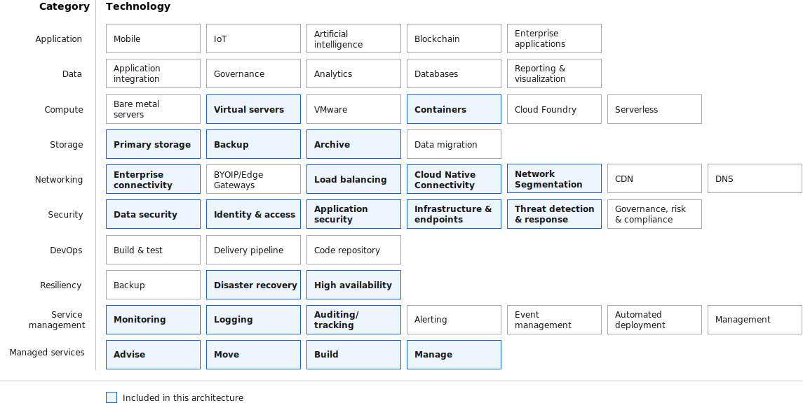

---

copyright:
  years: 2022, 2023
lastupdated: "2023-01-04"

keywords:

subcollection: acme-test

authors:
  - name: "Jenifer Schlotfeldt"
    email: "jschlot@us.ibm.com"
  - name: "Allen Dean"
    email: "allen.dean@us.ibm.com"

meta_description: This architecture shows a deployment of the VPC that uses Virtual Servers for VPC as the primary compute.

meta_keywords: financial services, VPC

meta_title: Single-region IBM Cloud for Financial Services reference architecture for VPC with Virtual Servers for VPC

version: 1.1

deployment-url: https://test.cloud.ibm.com/catalog/content/terraform-ibm-powervs-Catalog-powervs-sap-Infra-v1.0-af78b4f8-5963-401c-aa7d-a6173358d8c3-global?kind=terraform&format=terraform&version=1d903c30-efab-4f46-add1-c922b2d46479-global

docs: https://cloud.ibm.com/docs/framework-financial-services

image_source:

related_links:
  - title: 'Consumer connectivity to workload VPC'
    url: 'https://cloud.ibm.com/docs/framework-financial-services?topic=framework-financial-services-vpc-architecture-connectivity-workload#consumer-provider-public-internet'
    description: 'Reference architecture with edge/transit VPC for public internet access which enables consumers to access your service through the public internet.'

industry: Banking,FinancialSector

use case: CustomerExperience

compliance: FedRAMP

content-type: reference-architecture

---

{{site.data.keyword.attribute-definition-list}}

# VPC landing zone
{: #vpc-architecture-vsi}
{: toc-content-type="reference-architecture"}
{: toc-industry="Banking,FinancialSector"}
{: toc-use-case="CustomerExperience"}
{: toc-compliance="FedRAMP"}

Secure infrastructure on VPC for regulated industries is a preconfigured deployable architecture based on the IBM Cloud for Financial Services. This architecture creates a secure and compliant infrastructure to run your workloads with a Virtual Private Cloud (VPC). The architecture defines virtual servers in a secure VPC for your workloads.
{: shortdesc}

## Architecture diagram
{: #vpc-vsi-diagram}

{: caption="Figure 2. Single-region IBM Cloud for Financial Services reference architecture for VPC with virtual servers" caption-side="bottom"}

## Design requirements
{: #vpc-vsi-reqs}

{: caption="Figure 1. Scope of the solution requirements" caption-side="bottom"}

[{{site.data.keyword.vpc_full}} (VPC)](/docs/vpc?topic=vpc-about-vpc#about-vpc) is a public cloud offering that lets an enterprise establish its own private cloud-like computing environment on shared public cloud infrastructure. A VPC gives an enterprise the ability to define and control a virtual network that is logically isolated from all other public cloud tenants, creating a private, secure place on the public cloud. The VPC reference architecture for the {{site.data.keyword.cloud_notm}} for Financial Services is designed to provide a framework for building a VPC-based offering according to the [best practices and requirements](/docs/framework-financial-services?topic=framework-financial-services-best-practices) of the {{site.data.keyword.framework-fs_notm}}.

## Components
{: #vpc-vsi-components}

### Compute and storage architecture decisions
{: #vpc-architecture-compute-storage}

| Requirement | Component | Reasons for choice | Alternative choice |
|-----------|-------------|--------------------|--------------------|
| * Dedicated compute resources or shared compute with appropriate isolation \n * Workload and management control plane segmentation to enable strict separation of duties | VPC Virtual Server Instances (VSIs) | x86 compute option with the network isolation, security, and flexibility benefits of VPC. |
| Use dedicated hosts if application processes or keep regulated data in memory or to meet app performance requirements. | * VPC Virtual Server Instances (VSIs) \n * Dedicated Hosts for VPC VSIs \n * Red Hat OpenShift on IBM Cloud on VPC |
| Private repository for image | IBM Cloud Container Registry | (integrated with OpenShift Container Registry) | IBM Cloud Container Registry |
| * Dedicated storage or shared storage with appropriate data protection \n * Data encrypted with customer keys | * VPC Block Storage \n * VPC Block Storage and/or Cloud Object Storage, depending on workload requirement | * Provides hypervisor-mounted, high-performance data storage. \n * VPC Block supports Read Write Once (RWO) access. Cloud Object Storage supports s3s-fuse file access. | * VPC Block Storage \n * Cloud Object Storage \n * Portworx (Portworx supports block (RWO) and file (RWX) type access. The customer is responsible for compliance with FS controls.) |
| Audit records retention \n * Short-term (90-days) retention \n * Long-term (1 year) retention | Cloud Object Storage | Stores unstructured data as objects in a bucket. Used by Activity Tracking for Cloud Platform logs. | Cloud Object Storage |
{: caption="Table 1. Compute and storage architecture decisions" caption-side="bottom"}

### Service management decisions
{: #vpc-architecture-detailed-management}

The management VPC provides compute, storage, and network services to enable application provider administrators to monitor, operate, and maintain the environment. The intent is to completely isolate management operations from the VPC running consumer workloads.

The management VPC is distributed across three zones in one [multizone region (MZR)](/docs/overview?topic=overview-locations#mzr-table). Each zone contains two subnets that are protected by different ACLs.

You must use an MZR from the [list of regions](/docs/framework-financial-services?topic=framework-financial-services-best-practices#best-practices-financial-services-regions) that are approved for the {[fs-cloud-notm]}.
{: important}

| Requirement | Component | Reasons for choice | Alternative choice |
|-----------|-------------|--------------------|--------------------|
| Subnets for management tools |  {{site.data.keyword.block_storage_is_short}} | The top subnet in each zone is part of the default security group for the VPC. And, each of those subnets contains an arbitrary number of virtual server instances that use {{site.data.keyword.block_storage_is_short}}. These instances are where your management tools run. |                    |
| Connectivity inbound to VPC | {{site.data.keyword.dl_full_notm}} Dedicated | Connectivity from your application provider's enterprise environment to the management VPC is accomplished by using {{site.data.keyword.dl_full_notm}} Dedicated or {{site.data.keyword.cloud}} {{site.data.keyword.vpn_vpc_full}}. You must use one or the other.  \n  \n [{{site.data.keyword.dl_short}}](/docs/dl?topic=dl-dl-about) is the most secure way to enable connectivity from the application provider's on-premises environment to the management VPC. The speed and reliability of {{site.data.keyword.dl_short}} extends your organization's data center network and offers more consistent, higher-throughput connectivity, keeping traffic within the {{site.data.keyword.cloud_notm}} network. When using {{site.data.keyword.dl_short}}, a private [{{site.data.keyword.alb_full}} (ALB)](/docs/vpc?topic=vpc-load-balancers) is used to distribute traffic among multiple server instances within the same region of your VPC. | An alternative connectivity pattern requires use of the [{{site.data.keyword.vpn_vpc_short}}](/docs/vpc?topic=vpc-using-vpn) service to securely connect from your private network to the management VPC. {{site.data.keyword.vpn_vpc_short}} can be used as a static, route-based VPN or a policy-based VPN to set up an IPsec site-to-site tunnel between your VPC and your on-premises private network, or another VPC. When using {{site.data.keyword.vpn_vpc_short}}, you need to place the gateway in a subnet (shown in the lower left subnet in the diagram).|
|  | Bastion host | Regardless of whether you are using {{site.data.keyword.dl_short}} or {{site.data.keyword.vpn_vpc_short}} to connect to the management VPC, you need to ensure that all traffic is routed through a bastion host with session recording. The bastion host solution is depicted in the two rightmost lower subnets in the diagram. | |
| Connectivity between VPCs | Transit Gateway | The management VPC needs to connect to the workload VPC to deploy, configure, and operate the components and workloads that are found in the workload VPC. [{{site.data.keyword.tg_short}}](/docs/transit-gateway?topic=transit-gateway-about) is designed specifically for this purpose, and is the means for connecting your management VPC to your workload VPC.| |
{: caption="Table 1. Management decisions" caption-side="bottom"}

### Networking decisions
{: #vpc-architecture-detailed-workload}

The workload VPC provides compute, storage, and network services to support hosted applications and operations that deliver services to the consumer. Let's take a closer look at the components within the VPC.

Just like the management VPC, the workload VPC is spread across three zones. The workload VPC should be created in the same MZR as the management VPC.

| Requirement | Component | Reasons for choice | Alternative choice |
|-----------|-------------|--------------------|--------------------|
| Connectivity to workload VPC | {{site.data.keyword.dl_short}} | If the consumer is in the same organization as the application provider, then just like for the management VPC, {{site.data.keyword.dl_short}} can provide access to the workload VPC. | Alternatively, {{site.data.keyword.vpn_vpc_short}} can be used for site-to-site VPN connectivity. |
{: caption="Table 2. Workload decisions" caption-side="bottom"}

### Storage decisions
{: #vpc-architecture-detailed-services-encryption}

| Requirement | Component | Reasons for choice | Alternative choice |
|-----------|-------------|--------------------|--------------------|
| Primary book volume | {{site.data.keyword.block_storage_is_short}} | {{site.data.keyword.block_storage_is_short}} is automatically created for the primary book volume when you create a virtual server. You can also create more data volumes by using {{site.data.keyword.block_storage_is_short}} within any subnet.  \n By default, all boot and data volumes are encrypted at rest with IBM-managed encryption. There is no additional cost for this service. IBM-managed encryption uses the following industry standard protocols:  \n * AES-256 encryption  \n * Keys are managed in-house with Key Management Interoperability Protocol (KMIP)  \n  \n For all sensitive and consumer-owned data, the application provider should use customer-managed encryption. With this encryption method you can bring your own customer root key (CRK) to the cloud or have a key management service (KMS) generate a key for you. For {[fs-cloud-notm]}, the supported key management service is [{{site.data.keyword.hscrypto}} (HPCS)](/docs/hs-crypto?topic=hs-crypto-overview). Root keys encrypt volume and custom image passphrases with envelope encryption, a process that encrypts a key with another key. | |
| Backup and recovery, data archiving, cloud-native application building, and AI and big data analytics | {{site.data.keyword.cos_short}} | | [{{site.data.keyword.cos_short}}](/docs/cloud-object-storage?topic=cloud-object-storage-about-cloud-object-storage) is an alternative storage option that is useful for certain use cases, including backup and recovery, data archiving, cloud-native application building, and AI and big data analytics. {{site.data.keyword.cos_short}} stores encrypted and dispersed data across multiple geographic locations.  \n  \n By default, all objects that are stored in {{site.data.keyword.cos_short}} are encrypted by using randomly generated keys and an all-or-nothing-transform (AONT). While this default encryption model provides at-rest security, financial service workloads need full control over the data encryption keys used. Again, {{site.data.keyword.hscrypto}} should be used for this purpose.|
{: caption="Table 3. Storage and encryption decisions" caption-side="bottom"}

## Using {{site.data.keyword.cloud_notm}} services outside of a VPC
{: #vpc-architecture-detailed-connectivity-services}

To connect to {{site.data.keyword.cloud_notm}} services from your VPC, you need to use [Virtual Private Endpoints (VPE) for VPC](/docs/vpc?topic=vpc-about-vpe). In the reference architecture diagram, VPEs appear in the middle subnets of the workload VPC. With VPEs, you can connect to supported {{site.data.keyword.cloud_notm}} services from your VPC network by using the IP addresses of your choosing, which is allocated from a subnet within your VPC.

{{site.data.content.service-description-vpe}}

## Variation with edge/transit VPC for public internet access
{: #edge-vpc-architecture}

You might want to allow consumers to access your service through the public internet. This base architecture can be adapted to securely enable this type of access, which introduces a new edge VPC. The request from the consumer gets routed through a global load balancer, through a web application firewall in the edge VPC, and then to the public application load balancer within the workload VPC.

For complete details on this variation of the architecture, see [Consumer connectivity to workload VPC](/docs/framework-financial-services?topic=framework-financial-services-vpc-architecture-connectivity-workload#consumer-provider-public-internet).

## Next steps
{: #next-steps}

If you plan to use {{site.data.keyword.openshiftlong_notm}}, explore a more detailed view of the [VPC reference architecture with {{site.data.keyword.openshiftshort}}](/docs/framework-financial-services?topic=framework-financial-services-vpc-architecture-detailed-openshift)

If you don't plan to use {{site.data.keyword.openshiftlong_notm}}, you can skip ahead to learn more about deployment in [Setup environment for deployment and configuration](/docs/framework-financial-services?topic=framework-financial-services-shared-deployment-setup-environment).
